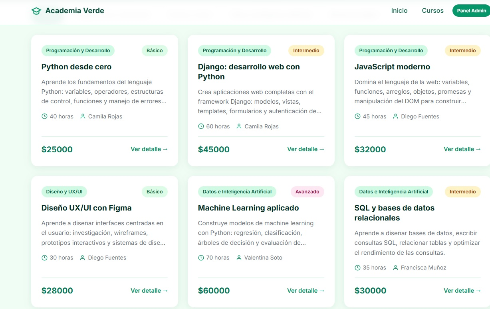
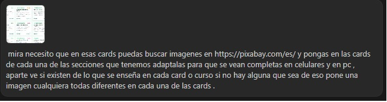
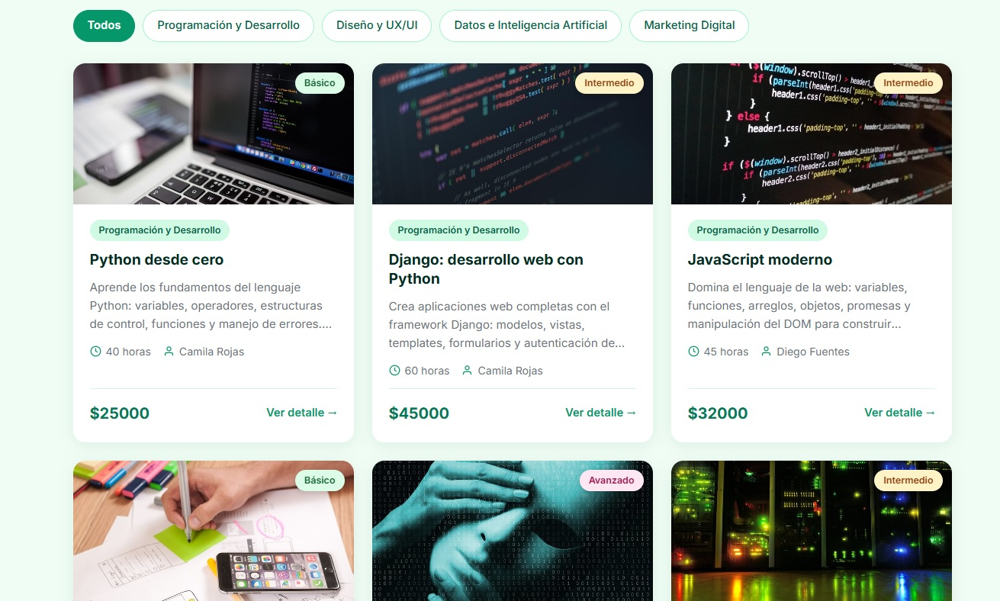

# Directorio de Cursos — Proyecto Django (Evaluación 1)

Bienvenidos a mi proyecto del módulo **"Desarrollo de aplicaciones del lado del servidor"**. Es un **Directorio de Cursos** que nace con datos en JSON (eval 1) y que está pensado para convertirse en una app (eval 2) y en una API con Django REST Framework (eval 3), manteniendo los mismos modelos y la misma base de datos.

Este README es mi **diario de trabajo**: lo voy actualizando en cada push con los pasos que voy completando.

---

## Semana 1 — Arranque del proyecto

### Qué hice con la ayuda de la IA (deepseek v4 flash)

Le pedí a la IA que me creara el **frontend completo** (HTML, CSS y JavaScript) mientras yo comenzaba con el backend de Django paso a paso, siguiendo la división de roles que nos indicó el profesor: el agente de IA hace el front y yo escribo el backend.

**El frontend quedó así (carpeta `front/`):**
- `index.html` — página principal con hero, buscador, filtros por categoría y grilla de tarjetas de cursos.
- `detalle.html` — ficha de cada curso con su instructor y cursos relacionados.
- `css/style.css` — estilo verde esmeralda, moderno y responsive.
- `js/app.js` — lee los datos desde `data/cursos.json` y renderiza todo en pantalla.
- `data/cursos.json` — los datos de prueba generados por la IA: **9 cursos, 4 categorías y 5 instructores**.

El front funciona solo con un servidor local: `python -m http.server 3000` dentro de `front/`.

### El backend que fui escribiendo (mi parte)

**Paso 1 — Entorno virtual:** creé el `venv` con `python -m venv venv` para aislar las dependencias de mi proyecto.

**Paso 2 — Paquetes instalados:** con el venv activado instalé `Django` y `django-filter` (este último es el **paquete externo** que pide la rúbrica para filtros y búsqueda):

```
asgiref==3.12.1
Django==6.1
django-filter==26.1
sqlparse==0.6.0
tzdata==2026.3
```

Las guardé en `requirements.txt`.

**Paso 3 — Proyecto y app:** tuve un problema: `django-admin` no se reconocía en Windows (faltaba el ejecutable), así que usé el comando oficial alternativo `python -m django startproject config .`. El punto (`.`) es importante porque crea el proyecto en la carpeta actual. Luego creé la app con `python manage.py startapp cursos`.

**Paso 4 — Modelos con relaciones (indicador 7):** escribí en `cursos/models.py` los tres modelos:
- `Categoria`: nombre, descripcion.
- `Instructor`: nombre, especialidad, email, anios_experiencia.
- `Curso`: titulo, slug, descripcion, nivel (con choices Básico/Intermedio/Avanzado), duracion_horas, precio, y dos **ForeignKey** hacia Categoria e Instructor (relación "muchos cursos a una categoría/instructor").

Detalle: los niveles en el modelo tienen que coincidir exactamente con el JSON (con tilde en "Básico"), sino Django rechaza el dato al cargarlo.

**Paso 5 — Registro de la app y migraciones:** al ejecutar `makemigrations` me salió `No installed app with label 'cursos'`, porque faltaba registrar la app. Agregué `'cursos'` y `'django_filters'` a `INSTALLED_APPS` en `config/settings.py` y las migraciones funcionaron:

```
Migrations for 'cursos':
  cursos\migrations\0001_initial.py
    + Create model Categoria
    + Create model Instructor
    + Create model Curso
```

Y `migrate` creó todas las tablas de la base de datos.

---

**Paso 6 — Comando de carga de datos desde JSON (indicador 2 y 11):** creé el management command `cursos/management/commands/cargar_datos.py` que lee el archivo `front/data/cursos.json` y puebla la base de datos usando `update_or_create`. Lo ejecuté con `python manage.py cargar_datos` y cargó exitosamente:
- 4 Categorías
- 5 Instructores
- 9 Cursos

**Paso 7 — Panel de Administración (prepara Eval 2):** registré los modelos en `cursos/admin.py` usando `@admin.register` con filtros (`list_filter`), buscadores (`search_fields`) y `prepopulated_fields` para el slug. Creé el superusuario con `python manage.py createsuperuser`.

**Paso 8 — Configuración de Static y Templates (indicador 8):** configuré `BASE_DIR / 'templates'` en `TEMPLATES['DIRS']` y `STATICFILES_DIRS` en `config/settings.py`. Copié los estilos CSS a `static/css/style.css`.

**Paso 9 — Plantillas Django (MVT, indicador 5 y 8):**
- `templates/base.html`: plantilla base con herencia (``), navbar, estilos con `` y enlaces dinámicos con ``.
- `templates/index.html`: catálogo completo con buscador, filtros dinámicos por categoría, estadísticas y tarjetas de cursos.
- `templates/detalle.html`: ficha individual del curso con datos del instructor y cursos relacionados de la misma categoría.

**Paso 10 — Vistas y URLs (indicador 2, 5 y 8):**
- Creé las vistas en `cursos/views.py`: `index` (con búsqueda `Q`, filtros por categoría y estadísticas) y `detalle_curso` (por slug, con cursos relacionados).
- Conecté las rutas en `cursos/urls.py` e incluí la app en `config/urls.py`.
- Probé todo con `python manage.py runserver` en `http://127.0.0.1:8000/` funcionando al 100%.

**Paso 11 — Ajustes finales de código y verificación general:**
- Realicé una revisión completa de los modelos, vistas y rutas para asegurar que todo estuviera correctamente estructurado, validando consultas del ORM y preparando la arquitectura de red para la evaluación.

**Paso 12 — Integración de imágenes temáticas desde Pixabay y diseño responsivo para móviles y PC:**
- **Situación inicial:** El sitio contaba con una estructura funcional completa, pero las tarjetas estaban sin imágenes (solo texto e insignias).
- **Intervención con IA (Gemini 3.8):** Como parte del **Indicador 10** (uso de herramientas de IA como apoyo técnico), le di a **Gemini 3.8** la instrucción precisa de buscar imágenes específicas y libres de derechos en Pixabay para cada materia (Python, Django, JavaScript, UX/UI, Machine Learning, SQL, Marketing Digital, APIs REST y Frontend), adaptando el diseño para que las fotos se vean completas y uniformes tanto en computadores como en celulares.
- **Implementación técnica:**
  - Descarga y almacenamiento local en `static/img/cursos/` y `front/img/cursos/` para garantizar funcionamiento offline y standalone.
  - Carátulas con altura fija (`185px`), proporción `16 / 9`, contención estricta (`overflow: hidden`), ajuste `object-fit: cover` y badges flotantes.
  - Media queries responsivas (`@media (max-width: 560px)`) para evitar cualquier desborde en pantallas móviles.

### Evidencias del proceso (Indicadores 10 y 11)

#### 1. Estado inicial — Catálogo sin imágenes
Las tarjetas presentaban únicamente la información textual y las etiquetas de categoría y nivel:


#### 2. Prompt entregado a Gemini 3.8
Captura de la instrucción proporcionada a la IA para buscar imágenes en Pixabay según el contenido de cada curso y adaptarlas a PC y celulares:


#### 3. Resultado final — Tarjetas con fotos temáticas adaptadas a PC y móviles
Así quedó el catálogo con las imágenes temáticas integradas, diseño responsivo y efectos visuales modernos:


---

## Arquitectura, Protocolos y Despliegue (Indicador 12)

- **Protocolo de comunicación:** en desarrollo la aplicación corre sobre **HTTP** estándar. El cliente (navegador) solicita recursos al servidor local de Django (`127.0.0.1` o `localhost`) en el puerto `8000` mediante peticiones GET.
- **Servicio de Hosting recomendado:** para pasar a producción se propone el despliegue en un PaaS como **Render** o **PythonAnywhere**, ejecutando la aplicación con un servidor WSGI de producción como **Gunicorn** y una base de datos PostgreSQL gestionada.
- **Dominio y Seguridad:** se conectaría un dominio personalizado (ej. `midirectorio.cl`) configurando registros DNS de tipo A y CNAME hacia el hosting, implementando **HTTPS** mediante certificados SSL/TLS automáticos (Let's Encrypt) para garantizar el cifrado de datos.

---

## Estado del Proyecto

- [x] Crear datos de prueba en JSON con IA (indicador 11).
- [x] Crear el frontend standalone (`front/`).
- [x] Crear entorno virtual e instalar Django y django-filter (indicador 3 y 6).
- [x] Modelos Django con relaciones ForeignKey (indicador 7).
- [x] Migraciones y creación de la BD SQLite (indicador 6).
- [x] Management command `cargar_datos` (indicador 2 y 11).
- [x] Registro en Django Admin con superusuario.
- [x] Configuración de templates y archivos estáticos (indicador 8).
- [x] Vistas y URLs de catálogo y detalle (indicador 2, 5 y 8).
- [x] Pruebas en servidor local `runserver` (indicador 4 y 9).
- [x] Últimos ajustes y verificación general en el código del backend.
- [x] Integración de imágenes temáticas desde Pixabay y diseño responsivo (PC y móviles).
- [x] Documentación de protocolos, hosting y despliegue (indicador 12).

---

## Cómo correr el proyecto

### Servidor Django (Backend + Frontend integrado)

**Opción 1 — Directa con el entorno virtual (Recomendada en Windows):**
Garantiza usar el Python y las librerías del `venv` (`django-filter`), evitando conflictos si PowerShell llama al Python global del sistema:
```powershell
.\venv\Scripts\python.exe manage.py runserver
```

**Opción 2 — Activando el entorno virtual previamente:**
```powershell
.\venv\Scripts\Activate.ps1
python manage.py runserver
```

- **Web principal:** http://127.0.0.1:8000/
- **Panel de administración:** http://127.0.0.1:8000/admin/

---

### (Opcional) Frontend Standalone (Sin Django)
Para visualizar el frontend estático leyendo de forma independiente desde `front/data/cursos.json`:
```powershell
cd front
python -m http.server 3000
```
- **Web:** http://localhost:3000