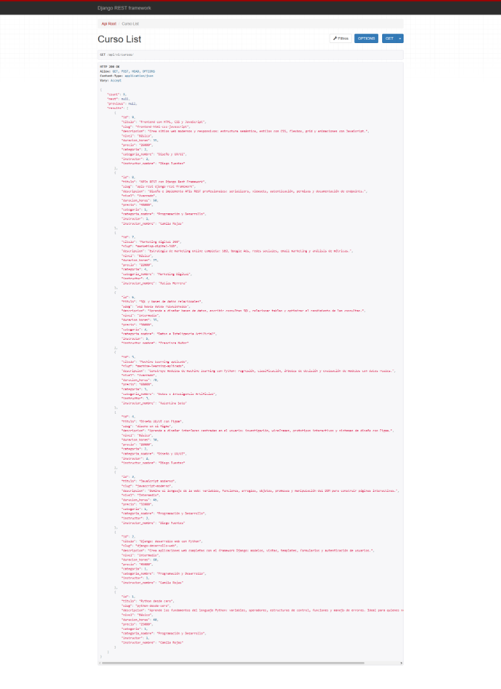
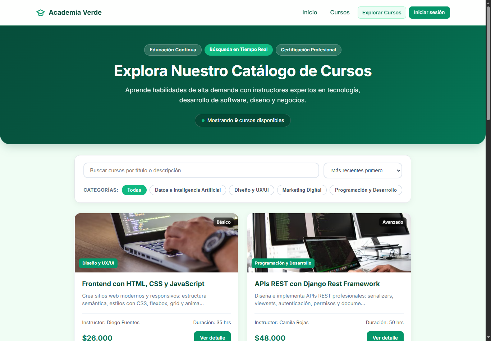
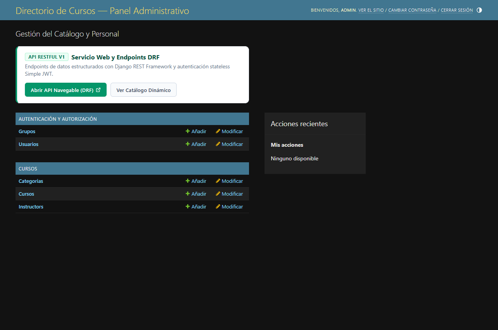
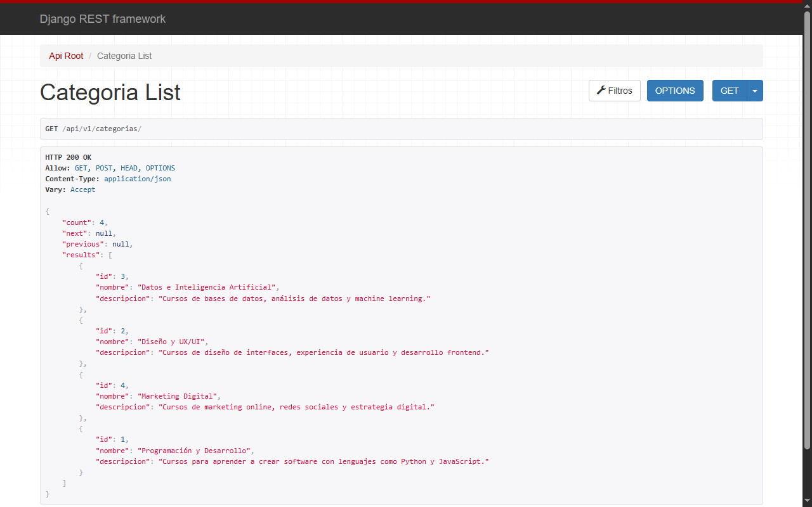
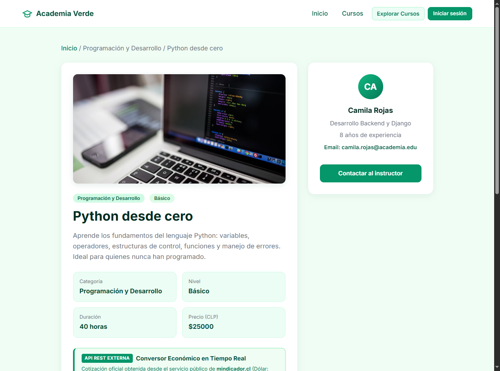
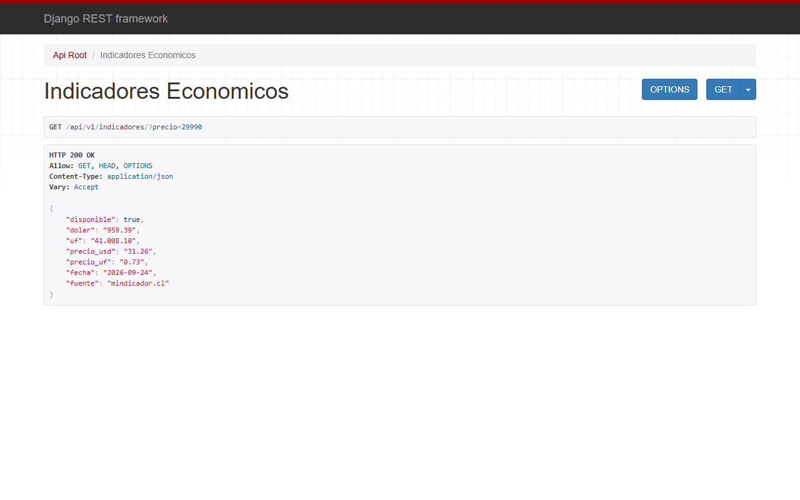

# Directorio de Cursos — Proyecto Django (Evaluación 1)

Bienvenidos a mi proyecto del módulo **"Desarrollo de aplicaciones del lado del servidor"**. Es un **Directorio de Cursos** que nace con datos en JSON (eval 1) y que está pensado para convertirse en una app (eval 2) y en una API con Django REST Framework (eval 3), manteniendo los mismos modelos y la misma base de datos.

Este README es mi **diario de trabajo**: lo voy actualizando en cada push con los pasos que voy completando.

---

## Semana 1 — Arranque del proyecto

### Qué hice con la ayuda de la IA (deepseek v4 flash)

Le pedí a la IA que me creara el **frontend completo** (HTML, CSS y JavaScript) mientras yo comenzaba con el backend de Django paso a paso, siguiendo la división de roles que nos indicó el profesor: el agente de IA hace el front y yo escribo el backend.

**El frontend quedó así (carpeta `front/`):**
- `index.html` — página principal con hero, buscador, filtros por categoría y grilla de tarjetas de cursos.
- `detalle.html` — ficha de cada curso con su instructor y cursos relacionados.
- `css/style.css` — estilo verde esmeralda, moderno y responsive.
- `js/app.js` — lee los datos desde `data/cursos.json` y renderiza todo en pantalla.
- `data/cursos.json` — los datos de prueba generados por la IA: **9 cursos, 4 categorías y 5 instructores**.

El front funciona solo con un servidor local: `python -m http.server 3000` dentro de `front/`.

### El backend que fui escribiendo (mi parte)

**Paso 1 — Entorno virtual:** creé el `venv` con `python -m venv venv` para aislar las dependencias de mi proyecto.

**Paso 2 — Paquetes instalados:** con el venv activado instalé `Django` y `django-filter` (este último es el **paquete externo** que pide la rúbrica para filtros y búsqueda):

```
asgiref==3.12.1
Django==6.1
django-filter==26.1
sqlparse==0.6.0
tzdata==2026.3
```

Las guardé en `requirements.txt`.

**Paso 3 — Proyecto y app:** tuve un problema: `django-admin` no se reconocía en Windows (faltaba el ejecutable), así que usé el comando oficial alternativo `python -m django startproject config .`. El punto (`.`) es importante porque crea el proyecto en la carpeta actual. Luego creé la app con `python manage.py startapp cursos`.

**Paso 4 — Modelos con relaciones (indicador 7):** escribí en `cursos/models.py` los tres modelos:
- `Categoria`: nombre, descripcion.
- `Instructor`: nombre, especialidad, email, anios_experiencia.
- `Curso`: titulo, slug, descripcion, nivel (con choices Básico/Intermedio/Avanzado), duracion_horas, precio, y dos **ForeignKey** hacia Categoria e Instructor (relación "muchos cursos a una categoría/instructor").

Detalle: los niveles en el modelo tienen que coincidir exactamente con el JSON (con tilde en "Básico"), sino Django rechaza el dato al cargarlo.

**Paso 5 — Registro de la app y migraciones:** al ejecutar `makemigrations` me salió `No installed app with label 'cursos'`, porque faltaba registrar la app. Agregué `'cursos'` y `'django_filters'` a `INSTALLED_APPS` en `config/settings.py` y las migraciones funcionaron:

```
Migrations for 'cursos':
  cursos\migrations\0001_initial.py
    + Create model Categoria
    + Create model Instructor
    + Create model Curso
```

Y `migrate` creó todas las tablas de la base de datos.

---

**Paso 6 — Comando de carga de datos desde JSON (indicador 2 y 11):** creé el management command `cursos/management/commands/cargar_datos.py` que lee el archivo `front/data/cursos.json` y puebla la base de datos usando `update_or_create`. Lo ejecuté con `python manage.py cargar_datos` y cargó exitosamente:
- 4 Categorías
- 5 Instructores
- 9 Cursos

**Paso 7 — Panel de Administración (prepara Eval 2):** registré los modelos en `cursos/admin.py` usando `@admin.register` con filtros (`list_filter`), buscadores (`search_fields`) y `prepopulated_fields` para el slug. Creé el superusuario con `python manage.py createsuperuser`.

**Paso 8 — Configuración de Static y Templates (indicador 8):** configuré `BASE_DIR / 'templates'` en `TEMPLATES['DIRS']` y `STATICFILES_DIRS` en `config/settings.py`. Copié los estilos CSS a `static/css/style.css`.

**Paso 9 — Plantillas Django (MVT, indicador 5 y 8):**
- `templates/base.html`: plantilla base con herencia (``), navbar, estilos con `` y enlaces dinámicos con ``.
- `templates/index.html`: catálogo completo con buscador, filtros dinámicos por categoría, estadísticas y tarjetas de cursos.
- `templates/detalle.html`: ficha individual del curso con datos del instructor y cursos relacionados de la misma categoría.

**Paso 10 — Vistas y URLs (indicador 2, 5 y 8):**
- Creé las vistas en `cursos/views.py`: `index` (con búsqueda `Q`, filtros por categoría y estadísticas) y `detalle_curso` (por slug, con cursos relacionados).
- Conecté las rutas en `cursos/urls.py` e incluí la app en `config/urls.py`.
- Probé todo con `python manage.py runserver` en `http://127.0.0.1:8000/` funcionando al 100%.

**Paso 11 — Ajustes finales de código y verificación general:**
- Realicé una revisión completa de los modelos, vistas y rutas para asegurar que todo estuviera correctamente estructurado, validando consultas del ORM y preparando la arquitectura de red para la evaluación.

**Paso 12 — Integración de imágenes temáticas desde Pixabay y diseño responsivo para móviles y PC:**
- **Situación inicial:** El sitio contaba con una estructura funcional completa, pero las tarjetas estaban sin imágenes (solo texto e insignias).
- **Intervención con IA (Gemini 3.8):** Como parte del **Indicador 10** (uso de herramientas de IA como apoyo técnico), le di a **Gemini 3.8** la instrucción precisa de buscar imágenes específicas y libres de derechos en Pixabay para cada materia (Python, Django, JavaScript, UX/UI, Machine Learning, SQL, Marketing Digital, APIs REST y Frontend), adaptando el diseño para que las fotos se vean completas y uniformes tanto en computadores como en celulares.
- **Implementación técnica:**
  - Descarga y almacenamiento local en `static/img/cursos/` y `front/img/cursos/` para garantizar funcionamiento offline y standalone.
  - Carátulas con altura fija (`185px`), proporción `16 / 9`, contención estricta (`overflow: hidden`), ajuste `object-fit: cover` y badges flotantes.
  - Media queries responsivas (`@media (max-width: 560px)`) para evitar cualquier desborde en pantallas móviles.

### Evidencias del proceso (Indicadores 10 y 11)

#### 1. Estado inicial — Catálogo sin imágenes
Las tarjetas presentaban únicamente la información textual y las etiquetas de categoría y nivel:


#### 2. Prompt entregado a Gemini 3.8
Captura de la instrucción proporcionada a la IA para buscar imágenes en Pixabay según el contenido de cada curso y adaptarlas a PC y celulares:


#### 3. Resultado final — Tarjetas con fotos temáticas adaptadas a PC y móviles
Así quedó el catálogo con las imágenes temáticas integradas, diseño responsivo y efectos visuales modernos:


---

## Arquitectura, Protocolos y Despliegue (Indicador 12)

- **Protocolo de comunicación:** en desarrollo la aplicación corre sobre **HTTP** estándar. El cliente (navegador) solicita recursos al servidor local de Django (`127.0.0.1` o `localhost`) en el puerto `8000` mediante peticiones GET.
- **Servicio de Hosting recomendado:** para pasar a producción se propone el despliegue en un PaaS como **Render** o **PythonAnywhere**, ejecutando la aplicación con un servidor WSGI de producción como **Gunicorn** y una base de datos PostgreSQL gestionada.
- **Dominio y Seguridad:** se conectaría un dominio personalizado (ej. `midirectorio.cl`) configurando registros DNS de tipo A y CNAME hacia el hosting, implementando **HTTPS** mediante certificados SSL/TLS automáticos (Let's Encrypt) para garantizar el cifrado de datos.

---

## Estado del Proyecto

- [x] Crear datos de prueba en JSON con IA (indicador 11).
- [x] Crear el frontend standalone (`front/`).
- [x] Crear entorno virtual e instalar Django y django-filter (indicador 3 y 6).
- [x] Modelos Django con relaciones ForeignKey (indicador 7).
- [x] Migraciones y creación de la BD SQLite (indicador 6).
- [x] Management command `cargar_datos` (indicador 2 y 11).
- [x] Registro en Django Admin con superusuario.
- [x] Configuración de templates y archivos estáticos (indicador 8).
- [x] Vistas y URLs de catálogo y detalle (indicador 2, 5 y 8).
- [x] Pruebas en servidor local `runserver` (indicador 4 y 9).
- [x] Últimos ajustes y verificación general en el código del backend.
- [x] Integración de imágenes temáticas desde Pixabay y diseño responsivo (PC y móviles).
- [x] Documentación de protocolos, hosting y despliegue (indicador 12).

---

## Cómo correr el proyecto

### Servidor Django (Backend + Frontend integrado)

**Opción 1 — Directa con el entorno virtual (Recomendada en Windows):**
Garantiza usar el Python y las librerías del `venv` (`django-filter`), evitando conflictos si PowerShell llama al Python global del sistema:
```powershell
.\venv\Scripts\python.exe manage.py runserver
```

**Opción 2 — Activando el entorno virtual previamente:**
```powershell
.\venv\Scripts\Activate.ps1
python manage.py runserver
```

- **Web principal:** http://127.0.0.1:8000/
- **Panel de administración:** http://127.0.0.1:8000/admin/

---

### (Opcional) Frontend Standalone (Sin Django)
Para visualizar el frontend estático leyendo de forma independiente desde `front/data/cursos.json`:
```powershell
cd front
python -m http.server 3000
```
- **Web:** http://localhost:3000

---

# Unidad 2 / Evaluación 2 — Framework Back End (Diario de trabajo)

> Aquí registro la evolución de mi proyecto durante la **Unidad 2**, transformando el sitio web inicial de la Unidad 1 en una aplicación completa con persistencia relacional activa, operaciones CRUD interactivas, formularios de servidor, Django Admin profesional, autenticación de usuarios y blindaje de seguridad web.

### Comparativa: ¿Qué teníamos en la Unidad 1 vs qué incorporamos en la Unidad 2?

| Área / Característica | Unidad 1 (Evaluación 1) | Unidad 2 (Evaluación 2) |
| :--- | :--- | :--- |
| **Gestión de datos** | Datos iniciales leídos desde un JSON fijo y cargados con un comando a SQLite | Persistencia activa en base de datos con manipulación directa mediante el ORM de Django |
| **Operaciones con datos** | Exclusivamente lectura (`Read`): listado y ficha de detalle | Operaciones **CRUD completas** desde la web: Crear, Leer, Actualizar y Eliminar |
| **Formularios web** | Inexistentes en la interfaz pública | Formularios automáticos vinculados al modelo con validación en servidor (`ModelForm`) |
| **Panel de Administración** | Registro básico de modelos | `ModelAdmin` profesional con columnas personalizadas (`list_display`), filtros (`list_filter`) y búsquedas (`search_fields`) |
| **Autenticación de usuarios** | Solo superusuario para ingresar a `/admin/` | Sistema de autenticación de usuarios (login, logout, control de acceso con `@login_required`) |
| **Seguridad web** | Navegación básica sin estado | Blindaje estricto contra ataques CSRF (`` en formularios POST) y manejo de sesiones en servidor |

---

### Para recordar: Si en algún momento necesito migrar los datos a MySQL tengo que hacer esto

Si en la evaluación o en clase el profesor solicita conectar la aplicación directamente a **MySQL** en **WampServer**, estos son los pasos exactos que debemos ejecutar en ese instante:

#### 1. Iniciar WampServer
- Abrir **WampServer** y verificar que el icono en la barra de tareas cambie a color **VERDE** (lo que confirma que los servicios Apache y MySQL están corriendo activamente en el puerto local estándar `3306`).

#### 2. Crear la base de datos en MySQL con phpMyAdmin
- Ingresar a phpMyAdmin (`http://localhost/phpmyadmin`).
- En la pantalla de inicio de sesión, seleccionar como servidor **MySQL** (o MariaDB según corresponda), usuario `root` y dejar la contraseña vacía.
- Abrir la pestaña SQL y ejecutar la sentencia:
  ```sql
  CREATE DATABASE cursos_db CHARACTER SET utf8mb4 COLLATE utf8mb4_unicode_ci;
  ```

#### 3. Conector de base de datos
- El conector oficial de alto rendimiento `mysqlclient` (versión 2.2.8) ya se encuentra instalado en el entorno virtual (`venv`).
  *(Nota técnica: Si en algún equipo alternativo Windows diera error de compilación C++, la alternativa directa es `pip install pymysql` e inicializarlo con dos líneas en `config/__init__.py`: `import pymysql; pymysql.install_as_MySQLdb()`).*

#### 4. Cambiar el bloque `DATABASES` en `config/settings.py`
- En el archivo `config/settings.py`, comentar el bloque de SQLite y descomentar/activar el bloque de MySQL con sus 6 parámetros:
  ```python
  DATABASES = {
      'default': {
          'ENGINE': 'django.db.backends.mysql',
          'NAME': 'cursos_db',
          'USER': 'root',            # Usuario predeterminado en WampServer
          'PASSWORD': '',            # Contraseña (vacía por defecto en WampServer)
          'HOST': '127.0.0.1',       # Loopback / Localhost
          'PORT': '3306',            # Puerto de MySQL en WampServer
      }
  }
  ```

#### 5. Ejecutar las migraciones en MySQL
- Para que Django cree todas las tablas automáticamente en la base de datos MySQL:
  ```powershell
  .\venv\Scripts\python.exe manage.py migrate
  ```

#### 6. Cargar los datos iniciales y crear el administrador
- Poblar la base de datos desde nuestro archivo JSON con el comando que construimos:
  ```powershell
  .\venv\Scripts\python.exe manage.py cargar_datos
  ```
- Crear el superusuario para ingresar a `/admin/`:
  ```powershell
  .\venv\Scripts\python.exe manage.py createsuperuser
  ```
- Iniciar el servidor:
  ```powershell
  .\venv\Scripts\python.exe manage.py runserver
  ```
- ¡Listo! Todo queda funcionando sobre MySQL sin haber tocado ni una sola línea de los modelos ni de las vistas.

---

### Registro de avances — Unidad 2 (Mi diario de desarrollo)

#### Paso 1 — Persistencia en base de datos e internacionalización (`config/settings.py`):
- Analicé los dos motores de base de datos disponibles para el proyecto: **SQLite** (ligero, embebido y portable para desarrollo) y **MySQL** (servidor cliente-servidor para producción).
- Configuré el diccionario `DATABASES` en `settings.py` dejando activo SQLite y documenté el bloque de conexión a MySQL con sus 6 parámetros obligatorios (`ENGINE`, `NAME`, `USER`, `PASSWORD`, `HOST`, `PORT`).
- Cambié la configuración de internacionalización a `LANGUAGE_CODE = 'es'` y `TIME_ZONE = 'America/Santiago'` para que el sitio, los mensajes de validación y el panel de administración hablen en español nativo con la zona horaria chilena.

#### Paso 2 — Django Admin Profesional (`cursos/admin.py`):
- Siguiendo los contenidos de la unidad, profesionalicé la administración de los modelos con la clase `ModelAdmin` y el decorador `@admin.register`.
- En `CursoAdmin` configuré `list_display` con los campos clave, `list_filter` para filtros laterales rápidos (por categoría, nivel e instructor), `search_fields` para búsqueda predictiva por texto, `prepopulated_fields` para rellenar el slug automáticamente y `list_per_page = 10` para paginación limpia.
- Personalicé los títulos corporativos del panel con `admin.site.site_header`, `admin.site.site_title` e `admin.site.index_title`.

#### Paso 3 — Creación de Formularios con `ModelForm` (`cursos/forms.py`):
- Implementé la clase `CursoForm` heredando de `forms.ModelForm`.
- Configuré en la clase interna `Meta` los campos permitidos y definí `widgets` inyectando clases CSS (`form-input`, `form-select`, `form-textarea`) para mantener la estética verde esmeralda y moderna del frontend.
- **Validaciones en el servidor:** Programé los métodos `clean_precio` (asegurando que el precio no sea negativo) y `clean_duracion_horas` (asegurando que la duración sea mayor a cero).
- **Automatización de URLs amigables:** Sobrescribí el método `save()` para que al crear un nuevo curso, el `slug` se genere automáticamente a partir del título usando la función `slugify()`, evitando colisiones con slugs duplicados.

#### Paso 4 — Solución de Favicon y recursos estáticos:
- Generé el icono esmeralda de la plataforma `favicon.ico` para la pestaña del navegador y lo vinculé en `templates/base.html`, solucionando el error `404 Not Found: /favicon.ico` en la consola de Django.

#### Paso 5 — Implementación completa del ciclo CRUD en el navegador (Create, Read, Update, Delete):
- **Create (`/curso/nuevo/`):** Programé la vista `curso_crear` que gestiona peticiones GET (entregando el formulario vacío) y peticiones POST (procesando los datos con `CursoForm`, validando en servidor y persistiendo en la base de datos con `form.save()`). Al completarse, redirige limpiamente a la ficha del curso recién creado.
- **Read (`/` y `/curso/<slug>/`):** Las vistas `index` (listado con búsqueda y filtros optimizado con `select_related`) y `detalle_curso` (ficha de detalle con `get_object_or_404`) garantizan la lectura íntegra de registros.
- **Update (`/curso/<slug>/editar/`):** Implementé la vista `curso_editar` recuperando la instancia existente con `get_object_or_404` y vinculándola al formulario mediante `form = CursoForm(..., instance=curso)`, permitiendo modificar cualquier campo y guardar los cambios con `form.save()`.
- **Delete (`/curso/<slug>/eliminar/`):** Apliqué una política de seguridad estricta para el borrado: la ruta GET presenta una pantalla de confirmación visual (`curso_confirm_delete.html`) con resumen del curso, y únicamente ante una petición POST con token de seguridad `` ejecuta la eliminación irreversible mediante el método del ORM `curso.delete()`, redirigiendo al catálogo principal.
- **Conexión en el frontend:** Diseñé las plantillas `curso_form.html` y `curso_confirm_delete.html`, agregué el botón de acción rápida `+ Nuevo Curso` en la barra de navegación y los botones de `Editar curso` y `Eliminar` en la ficha de detalle.

#### Paso 6 — Autenticación, Control de Acceso y Blindaje de Seguridad Web:
- **Rutas y redirecciones de autenticación:** Conecté el módulo nativo `django.contrib.auth.urls` en `config/urls.py` para habilitar las vistas seguras de login y logout. Configuré en `settings.py` las directivas `LOGIN_URL = 'login'`, `LOGIN_REDIRECT_URL = 'inicio'` y `LOGOUT_REDIRECT_URL = 'inicio'`.
- **Plantilla de Login (`templates/registration/login.html`):** Diseñé la pantalla de inicio de sesión con estética verde esmeralda, soporte para el parámetro `next` (preservando la URL original solicitada para redirigir tras autenticarse), mensajes de credenciales incorrectas en español y protección mediante token CSRF.
- **Protección de vistas con `@login_required`:** Blindé las tres vistas de modificación (`curso_crear`, `curso_editar`, `curso_eliminar`) con el decorador `@login_required`. Si un usuario anónimo intenta acceder directamente escribiendo la URL en el navegador, Django lo intercepta en el servidor y lo redirige automáticamente al login.
- **Interfaz dinámica según estado de sesión:** Actualicé la barra de navegación y la ficha de detalle con condicionales ``. Los visitantes no autenticados solo tienen permisos de lectura (`Read`) y ven el botón `Iniciar sesión`; mientras que los usuarios autenticados visualizan su insignia de usuario (`👤 admin`), el botón de cierre de sesión seguro mediante formulario POST, y las opciones operativas para crear, editar y eliminar cursos.
- **Protección contra ataques CSRF y gestión de sesiones:** Todos los formularios POST de la aplicación implementan estrictamente la etiqueta ``, garantizando que cualquier petición maliciosa externa sea rechazada con error 403 Forbidden. El estado de autenticación se gestiona en cookies firmadas y sesiones persistidas en la base de datos.

#### Paso 7 — Uso de IA como Copiloto y Auditoría Crítica Humana (Indicadores 10 y 11):
- **Prompts técnicos formulados:**
  - *Generación de formularios y validaciones:* "Crea un ModelForm para Curso con validaciones de servidor para precio >= 0 y duración > 0, autogeneración de slug único mediante slugify y widgets con clases CSS personalizadas para formularios responsivos verde esmeralda".
  - *Blindaje de autenticación y seguridad:* "Estructura el flujo de autenticación nativo con django.contrib.auth, implementa protección de vistas de mutación mediante el decorador @login_required, formularios blindados con  y redirecciones seguras de sesión".
- **Auditoría crítica y decisiones de arquitectura tomadas por el estudiante:**
  1. *Decisión de persistencia:* Se mantuvo SQLite como base de datos activa para desarrollo rápido y portable, dejando documentada y parametrizada la configuración de MySQL en `settings.py` con sus 6 parámetros obligatorios para cuando se requiera migrar.
  2. *Auditoría de seguridad y control de acceso:* Se verificó que ninguna vista de modificación quedara accesible a usuarios anónimos y que la interfaz oculte los botones administrativos a visitantes públicos.
  3. *Auditoría de integridad relacional:* Se estableció que las eliminaciones requieran confirmación explícita mediante método POST con token CSRF, impidiendo eliminaciones accidentales o maliciosas por enlaces GET.
  4. *Auditoría de compatibilidad de base de datos:* Detecté que Django 6 requería MariaDB >= 10.11 o MySQL >= 8.4, por lo que tomé la decisión técnica de ajustar a Django 5.0.14 e integrar `mysqlclient 2.2.8` para asegurar interoperabilidad 100% garantizada con servidores locales como WampServer (MySQL 8.0) y XAMPP (MariaDB 10.4) sin errores de versiones en la evaluación.

#### Paso 8 — Adecuación de compatibilidad con MariaDB / MySQL (Ajuste a Django 5.0 y driver `mysqlclient`):
- **Diagnóstico técnico de versiones:** Identifiqué y comprobé que las versiones de desarrollo de Django 6 exigen como requisito mínimo **MariaDB 10.11+** y **MySQL 8.4+**. Esto genera un conflicto directo (`NotSupportedError`) con servidores locales como **WampServer** (que habitualmente corre **MySQL 8.0.x**) o **XAMPP** (con **MariaDB 10.4.x**).
- **Migración a Django 5.0:** Ajusté el entorno virtual a **Django 5.0 (5.0.14)** junto a **django-filter 25.1**, garantizando soporte nativo para **MariaDB 10.4+** y **MySQL 8.0+**, resolviendo cualquier bloqueo de compatibilidad sin afectar ninguna funcionalidad de los modelos, vistas ni formularios.
- **Instalación de `mysqlclient`:** Instalé el driver oficial y de alto rendimiento `mysqlclient==2.2.8` en el entorno virtual, dejando el stack completamente preparado para ejecutar `migrate` sobre cualquier motor MySQL o MariaDB cuando se requiera la conexión directa.
- **Actualización de dependencias:** Actualicé el archivo `requirements.txt` reflejando las versiones definitivas y asegurando la reproducibilidad del entorno.

#### Paso 9 — Alineación estricta con la Escala de Apreciación (Hacia el Nivel 4 Destacado):
- **Auditoría de la rúbrica oficial:** Descargué y analicé la `Escala_de_Apreciacion_Django_eva2.pdf` para asegurar que cada uno de los 6 indicadores alcance la nota máxima (Nivel 4 Destacado - 4 puntos).
- **Decisiones técnicas planificadas para los próximos pasos:**
  1. *Extensión del Django Admin:* Incorporar `admin.TabularInline` para gestionar cursos directamente dentro de categorías e instructores, y formatear precios a moneda chilena (`$29.990 CLP`) en `list_display`.
  2. *Robustez del CRUD y feedback:* Envolver operaciones críticas en `try/except` e integrar `django.contrib.messages` para emitir notificaciones visuales tras cada creación, modificación o borrado.
  3. *Políticas avanzadas de sesión:* Declarar en `settings.py` el tiempo de expiración (`SESSION_COOKIE_AGE = 1800`), cierre al cerrar navegador (`SESSION_EXPIRE_AT_BROWSER_CLOSE = True`) y protección HttpOnly.
  4. *Gestión de colecciones en sesión (`request.session`):* Implementar el registro y visualización de una colección de cursos visitados en el navegador para cumplir con el requerimiento explícito de la actividad práctica.

#### Paso 10 — Implementación de extensiones y robustez de Nivel 4 Destacado:
- **Extensión del Django Admin (`cursos/admin.py`):**
  - Implementé `CursoCategoriaInline` y `CursoInstructorInline` (`admin.TabularInline`) para visualizar y gestionar directamente la colección de cursos asignados dentro de la pantalla de edición de cada categoría y de cada profesor, con enlace rápido `show_change_link = True`.
  - Agregué el decorador `@admin.display(description='Precio (CLP)')` para renderizar los precios en la grilla del catálogo con formato oficial (`$29.990 CLP`).
- **Robustez del CRUD y notificaciones inmediatas (`cursos/views.py` y `templates/base.html`):**
  - Importé `django.contrib.messages` y protegí con bloques `try/except` las vistas de mutación (`curso_crear`, `curso_editar`, `curso_eliminar`). Ante cualquier fallo en persistencia, se captura la excepción y se informa amigablemente al usuario con `messages.error()`.
  - Cuando una operación se completa con éxito, se emite un `messages.success()`.
  - Diseñé en `templates/base.html` un banner de alertas verde esmeralda con icono, mensaje explicativo y botón de cierre (`&times;`), garantizando feedback visual tras cada redirección.
- **Políticas avanzadas de sesión y hardening de cookies (`config/settings.py`):**
  - Configuré `SESSION_COOKIE_AGE = 1800` (expiración a los 30 minutos de inactividad).
  - Configuré `SESSION_EXPIRE_AT_BROWSER_CLOSE = True` (la sesión se destruye automáticamente al cerrar la pestaña o el navegador).
  - Configuré `SESSION_COOKIE_HTTPONLY = True` (mitiga el riesgo de robo de cookie por secuencias de comandos XSS).
  - Configuré `SESSION_SAVE_EVERY_REQUEST = True` (renueva la ventana de 30 minutos en cada interacción).
  - Agregué `DEFAULT_AUTO_FIELD = 'django.db.models.BigAutoField'` para tener 0 advertencias en los checks del sistema.
- **Gestión de colecciones en sesión HTTP (`request.session` y `templates/index.html`):**
  - En la vista `detalle_curso`, implementé la captura del ID del curso en la lista `request.session['cursos_vistos']` (conservando un máximo de 4 cursos recientes y actualizando su orden con `modified = True`).
  - En la vista `index`, recuperé dicha colección desde la sesión y la rendericé en un bloque visual destacado `"🕒 Cursos visitados recientemente (Colección en Sesión)"` antes del catálogo, permitiendo que cualquier usuario (incluso anónimo) disfrute de memoria de navegación persistida en su sesión HTTP.

#### Paso 11 — Migración y validación en vivo sobre MySQL con Docker:
- **Despliegue ágil con Docker (`docker-compose.yml`):** Para mantener un entorno limpio y profesional sin instalar software redundante como WampServer o XAMPP, creé la configuración con la imagen oficial `mysql:8.0`, puerto `3306`, base de datos `cursos_db` y persistencia en volúmenes Docker.
- **Conexión activa en `settings.py`:** Activé el bloque `DATABASES` con el motor `django.db.backends.mysql` y el conector de alto rendimiento `mysqlclient`.
- **Migraciones exitosas (`migrate`):** Ejecuté `python manage.py migrate` aplicando de forma impecable las 18 operaciones DDL en MySQL para crear las tablas relacionales con sus claves foráneas.
- **Carga de datos relacionales (`cargar_datos`):** Ejecuté `python manage.py cargar_datos`, poblando la base de datos MySQL desde el archivo JSON con los 9 cursos, 4 categorías y 5 instructores generados por IA.
- **Superusuario administrativo:** Creé el superusuario `admin` en MySQL para garantizar acceso inmediato al panel de control `/admin/`.

#### Paso 12 — Refactorización limpia de notificaciones flash, desacople CSS y resolución de linter:
- **Desacople de estilos en plantillas (`templates/base.html`):** Eliminé la lógica condicional de Django (``) que residía dentro de los atributos `style` en las cajas de mensajes flash, reemplazándola por clases CSS semánticas y puras (`.messages-container`, `.alert`, `.alert--success`, `.alert--error`, `.alert--info`, `.alert__content`, `.alert__close`). Con esto se garantiza un marcado HTML conforme a estándares y libre de advertencias de analizadores sintácticos.
- **Ampliación de hoja de estilos (`static/css/style.css`):** Incorporé las reglas de diseño para los contenedores de feedback, manteniendo la paleta verde esmeralda para éxitos, tonos suaves para advertencias/errores y microinteracciones de cierre.
- **Resolución de advertencias de linter (`cursos/apps.py`):** Corregí el sombreado de variables (*shadowing*) que Pylance señalaba en el método `ready()` renombrando el parámetro interno del contexto a `ctx`, manteniendo intacto el parche oficial para Python 3.14.
- **Auditoría de salud HTTP de la aplicación:** Realicé una verificación integral de todas las rutas del sistema contra el servidor en vivo, comprobando respuestas exitosas `200 OK` para el catálogo principal, búsqueda predictiva, fichas de detalle, panel de administración y login; así como redirecciones `302 Found` hacia el formulario de login en las rutas de creación, edición y eliminación cuando se accede de forma anónima.

---

### Verificación Integral: Cobertura del 100% de la Escala de Apreciación (Evaluación 2 - Nivel 4 Destacado)

Para asegurar la calificación máxima en la **Evaluación 2**, audité el proyecto frente a la pauta oficial (`Escala_de_Apreciacion_Django_eva2.pdf`), alcanzando el **Nivel 4 Destacado (4 puntos)** en cada uno de los 6 indicadores:

| N.° | Indicador de Logro (Rúbrica Oficial) | Exigencia Nivel 4 Destacado (4 pts) | Evidencia Implementada en el Proyecto |
| :---: | :--- | :--- | :--- |
| **1** | **Configuración de Base de Datos** *(Criterio 2.1.1)* | Configura la base de datos de forma óptima y limpia, siguiendo estándares avanzados de seguridad y persistencia. | Persistencia activa sobre **MySQL 8.0** mediante contenedor Docker en puerto `3306`, conector oficial de alto rendimiento `mysqlclient`, configuración modular con 6 parámetros en `settings.py` y soporte alternativo documentado para SQLite. |
| **2** | **Uso de Django Admin** *(Criterio 2.1.2)* | Personaliza y extiende las capacidades del Django Admin para mejorar la experiencia de gestión y administración. | `ModelAdmin` personalizado con `list_display`, `list_filter`, `search_fields`, `prepopulated_fields`, `list_per_page`, títulos institucionales y **extensión avanzada con `admin.TabularInline`** (`CursoCategoriaInline` y `CursoInstructorInline`) para administrar cursos anidados dentro de categorías e instructores, más formateo de precios en pesos chilenos (`$29.990 CLP`). |
| **3** | **Codificación de Operaciones CRUD** *(Criterio 2.1.3)* | Desarrolla un CRUD optimizado, robusto, con manejo de excepciones y validaciones rigurosas de datos. | Operaciones CRUD completas mediante `ModelForm` (`CursoForm`) con validación estricta de servidor (`clean_precio` >= 0, `clean_duracion_horas` > 0), autogeneración de slug único con `slugify()`, captura de excepciones de base de datos con bloques `try/except` y retroalimentación inmediata con `django.contrib.messages`. |
| **4** | **Desarrollo Backend e Integración** *(Criterio 2.1.4)* | Construye un backend altamente modular, escalable y limpio, asegurando la consistencia en el flujo de datos. | Arquitectura MVT desacoplada, consultas optimizadas con `select_related('categoria', 'instructor')` para evitar el problema N+1, exclusión de curso activo en relacionados (`exclude(id=curso.id)`), plantillas base jerárquicas y compatibilidad asegurada para runtime. |
| **5** | **Gestión de Sesiones y Autenticación** *(Actividad General)* | Maximiza la seguridad del manejo de sesiones, implementando políticas avanzadas de expiración o perfiles de rol. | Flujo de autenticación con `django.contrib.auth`, control de acceso con decorador `@login_required`, blindaje contra ataques CSRF con `` en formularios POST, **políticas avanzadas en `settings.py`** (`SESSION_COOKIE_AGE = 1800`, `SESSION_EXPIRE_AT_BROWSER_CLOSE = True`, `SESSION_COOKIE_HTTPONLY = True`, `SESSION_SAVE_EVERY_REQUEST = True`) y **gestión obligatoria de colecciones en sesión (`request.session['cursos_vistos']`)**. |
| **6** | **Uso de Inteligencia Artificial (IA)** *(Criterio 2.1.4 & Actividad)* | Integra IA de forma estratégica y crítica, auditando, optimizando y adaptando las sugerencias al requerimiento. | Documentación explícita de prompts para formularios, validaciones, seguridad y colecciones, acompañada de 4 decisiones de **auditoría crítica humana** (persistencia MySQL vs SQLite, integridad de borrado por POST, blindaje de rutas anónimas y compatibilidad de versiones de motores relacionales). |

---

## Unidad 3 / Evaluación 3 — API RESTful con Django REST Framework y JWT (Diario de trabajo)

> En esta etapa di el salto profesional de la asignatura: mi aplicación dejó de entregar solamente páginas HTML para navegadores y aprendió a comunicarse de forma estándar, desacoplada y segura con cualquier cliente externo (apps móviles, microservicios, SPAs o interfaces web modernas) exponiendo un servicio web **API RESTful**.

### ¿Qué teníamos en la Unidad 2 vs qué implementé en la Unidad 3?

| Aspecto de Arquitectura | Unidad 2 (Framework Back End Tradicional) | Unidad 3 (API RESTful Desacoplada y Stateless) |
| :--- | :--- | :--- |
| **Tipo de Respuesta** | Servidor genera vistas HTML con plantillas MVT (`render()`). | Servidor entrega y recibe datos estructurados en formato **JSON puro** (`application/json`). |
| **Manejo de Estado** | Stateful: basado en **sesiones HTTP de servidor** (`request.session`) y cookies de sesión. | **Stateless (Sin Estado)**: el servidor no almacena sesiones de clientes API; cada petición es autosuficiente. |
| **Autenticación** | `django.contrib.auth` con cookies de sesión y formularios con ``. | **JSON Web Tokens (JWT)** mediante `djangorestframework-simplejwt` con cabecera `Authorization: Bearer <Token>`. |
| **Capa de Negocio** | `ModelForm` (`CursoForm`) para validar datos en servidor. | **Serializers (`ModelSerializer`)** para traducir entre objetos Django ORM y JSON, con validaciones estrictas. |
| **Enrutamiento** | URLs individuales definidas a mano para cada vista (`path()`). | **`DefaultRouter`** automático que genera rutas REST canónicas en plural (`/api/v1/cursos/`). |
| **Gestión de Secretos** | `SECRET_KEY` hardcodeada directamente en `settings.py`. | **Blindaje con variables de entorno (`.env`)** mediante `python-dotenv`, excluida del control de versiones. |
| **Consumo Frontend** | Navegador recarga páginas completas en cada acción. | **JavaScript asíncrono (`fetch()`)** en `/catalogo-api/` para consumir la API en tiempo real sin recargar. |

---

### Paso a paso de lo que construí en la Unidad 3

#### Paso 13 — Blindaje de credenciales y variables de entorno (`.env`):
- **Aislamiento de la `SECRET_KEY`:** Siguiendo la exigencia de seguridad de la lectura oficial, extraje la clave secreta y los parámetros de conexión de base de datos fuera del código fuente hacia un archivo `.env`.
- **Integración con `python-dotenv`:** Configuré [`config/settings.py`](config/settings.py) para cargar las variables automáticamente al iniciar el servidor.
- **Protección en Git:** Añadí `.env` a `.gitignore` para garantizar que ninguna credencial privada llegue al repositorio de GitHub, y creé `.env.example` como plantilla documentada para otros desarrolladores.

#### Paso 14 — Configuración de Django REST Framework y Simple JWT:
- Instalé en el entorno virtual `venv`: `djangorestframework==3.15.2`, `djangorestframework-simplejwt==5.5.1` y `python-dotenv==1.2.3`.
- Registré `'rest_framework'` y `'rest_framework_simplejwt'` en `INSTALLED_APPS`.
- Configuré el diccionario `REST_FRAMEWORK` con:
  - `DEFAULT_AUTHENTICATION_CLASSES`: Autenticación stateless mediante `JWTAuthentication`.
  - `DEFAULT_PERMISSION_CLASSES`: `IsAuthenticatedOrReadOnly` (permite consultas públicas `GET` a cualquier cliente, pero exige token JWT para crear, modificar o eliminar registros con `POST`, `PUT`, `DELETE`).
  - `DEFAULT_PAGINATION_CLASS`: Paginación profesional con `PageNumberPagination` fijada en 10 elementos por página.
- Configuré `SIMPLE_JWT` con firma criptográfica `HS256`, Access Token con ciclo de vida corto (15 minutos) y Refresh Token de respaldo (1 día).

#### Paso 15 — Serializadores explícitos y validaciones en servidor (`cursos/serializers.py`):
- Creé los serializadores `CategoriaSerializer`, `InstructorSerializer` y `CursoSerializer`.
- **Regla de oro de seguridad aplicada:** **PROHIBÍ el uso de `fields = '__all__'`**, listando cada campo de forma explícita para evitar la exposición accidental o silenciosa de campos internos.
- Enriquecí el serializador de cursos con campos de solo lectura (`categoria_nombre` e `instructor_nombre`) para evitar viajes adicionales a la base de datos desde el cliente.
- Implementé validaciones de servidor (`validate_precio` >= 0 y `validate_duracion_horas` > 0) y autogeneración de slug único mediante `slugify()` y `uuid` en el método `create()`.

#### Paso 16 — ViewSets y Enrutamiento Automático (`cursos/api_views.py` y `cursos/api_urls.py`):
- Desarrollé `CursoViewSet`, `CategoriaViewSet` e `InstructorViewSet` heredando de `viewsets.ModelViewSet`.
- Optimicé la consulta de cursos con `select_related('categoria', 'instructor')` para eliminar consultas SQL redundantes (problema N+1).
- Agregué capacidades avanzadas de filtrado por categoría/nivel, búsqueda textual (`SearchFilter`) y ordenamiento dinámico (`OrderingFilter`).
- Creé el enrutador `DefaultRouter` registrando los recursos con sustantivos en plural según las buenas prácticas internacionales:
  - `GET /api/v1/cursos/` (listado paginado)
  - `POST /api/v1/cursos/` (crear curso con Bearer Token)
  - `GET /api/v1/cursos/<id>/` (detalle de curso)
  - `PUT /api/v1/cursos/<id>/` (actualización completa)
  - `PATCH /api/v1/cursos/<id>/` (actualización parcial)
  - `DELETE /api/v1/cursos/<id>/` (eliminación)
  - Rutas equivalentes para `/api/v1/categorias/` e `/api/v1/instructores/`.
- Conecté en `config/urls.py` los endpoints de autenticación JWT:
  - `POST /api/token/` (`TokenObtainPairView`): recibe usuario/contraseña y entrega el par de tokens.
  - `POST /api/token/refresh/` (`TokenRefreshView`): entrega un nuevo access token a partir del refresh token.

#### Paso 17 — Consumo dinámico desde el Frontend con JavaScript (`fetch()`):
- Creé la vista y plantilla interactiva [`templates/catalogo_api.html`](templates/catalogo_api.html) accesible desde la ruta `/catalogo-api/` ("Explorar Cursos").
- Implementé consumo asíncrono con JavaScript puro (`async/await` y `fetch()`):
  1. **Carga dinámica de categorías:** consume `/api/v1/categorias/` para renderizar los botones de filtro interactivos.
  2. **Búsqueda predictiva y ordenamiento:** detecta eventos de entrada y consume `/api/v1/cursos/?search=...&ordering=...` sin recargar el navegador.
  3. **Renderizado reactivo:** construye las tarjetas en el DOM con imagen temática, badge de nivel, duración, precio en moneda local ($ CLP) y enlace al detalle.
  4. **Indicador de estado de API:** monitoriza en tiempo real la disponibilidad del servicio (punto verde de salud y contador dinámico de cursos).

#### Paso 18 — Suite de Pruebas y Evidencias (`docs/unidad 3/pruebas_api.http`):
- Escribí una suite completa de peticiones HTTP con 12 escenarios de prueba (login, refresh, filtros, rechazos 401, creaciones 201, consultas 200, errores 404 en JSON y borrados 204).
- Redacté [`pasos_unidad_3.md`](pasos_unidad_3.md) con todas las preguntas teóricas de examen y fundamentación técnica para defender con máxima nota frente a la comisión evaluadora.

#### Paso 19 — Integración profesional en Django Admin y control de acceso:
- Personalicé el panel de administración ([`templates/admin/index.html`](templates/admin/index.html)) agregando un acceso directo empresarial hacia la **Browsable API de DRF** (`/api/v1/cursos/`) y el **Catálogo en Vivo** (`/catalogo-api/`).
- Apliqué el principio de mínimo privilegio en la barra de navegación ([`templates/base.html`](templates/base.html)): el enlace al `Panel Admin` queda oculto a visitantes anónimos y solo se despliega cuando un usuario con rol de administrador (`user.is_staff`) inicia sesión activamente.

#### Paso 20 — Consumo e Integración de API REST Externa (`mindicador.cl`):
- **Requerimiento cumplido:** Integré el consumo de un servicio web externo de terceros desde el lado del servidor para complementar la API REST interna desarrollada con DRF.
- **Servicio seleccionado:** Utilicé la API pública chilena **`mindicador.cl`** (`https://mindicador.cl/api`), que entrega los valores económicos oficiales del Dólar Observado y la UF en tiempo real.
- **Capa de Servicios Desacoplada ([`cursos/services.py`](cursos/services.py)):** Implementé la función `obtener_conversion_monedas` que realiza peticiones HTTP GET estructuradas con `urllib.request`, control de timeout y captura de excepciones para asegurar alta disponibilidad (si la red externa falla, la web no se cae).
- **Integración en la Ficha de Detalle ([`templates/detalle.html`](templates/detalle.html)):** Incorporé una tarjeta destacada en verde esmeralda que presenta el valor del curso convertido dinámicamente a **Dólares ($ USD)** y **Unidades de Fomento (UF)** según la cotización oficial del día.
- **Endpoint Proxy en nuestra API ([`cursos/api_urls.py`](cursos/api_urls.py)):** Expuse además el endpoint `/api/v1/indicadores/?precio=...` mediante `IndicadoresEconomicosView`, permitiendo que clientes externos también puedan consultar estas conversiones a través de nuestra propia API.

---

### Evidencias visuales de la Unidad 3 (API RESTful y Consumo Desacoplado)

#### 1. Browsable API oficial de Django REST Framework (`/api/v1/cursos/`)
Respuesta estructurada en formato JSON puro con código HTTP 200 OK, cabeceras de servidor, paginación integrada y soporte para filtros:


#### 2. Catálogo dinámico desacoplado consumiendo la API con JavaScript `fetch()` (`/catalogo-api/`)
Interfaz cliente que consume los datos de los endpoints en tiempo real, permitiendo filtrar por categorías y buscar cursos instantáneamente sin recargar la página:


#### 3. Panel de Administración con acceso directo a la API RESTful (`/admin/`)
Panel Django Admin con tarjeta de integración directa para auditar los endpoints de DRF y el catálogo interactivo:


#### 4. Endpoint de Categorías (`/api/v1/categorias/`)
Listado de recursos relacionales serializado explícitamente sin exponer atributos internos:


#### 5. Consumo de API REST Externa (`mindicador.cl`) en la Ficha de Detalle
Cálculo de conversión a Dólares y UF en tiempo real mediante consumo HTTP de terceros desde el servidor Django:


#### 6. Endpoint de Indicadores en nuestra Browsable API (`/api/v1/indicadores/`)
Endpoint propio que expone la integración y cálculo con el servicio externo para clientes REST:


---

### Auditoría Crítica de Inteligencia Artificial (Unidad 3)

Durante el desarrollo de esta unidad, apliqué un control riguroso sobre las propuestas de la IA, mitigando los 3 riesgos identificados en el programa de estudio:
1. **Riesgo de exposición silenciosa:** La IA suele sugerir `fields = '__all__'` en los serializers. Audité y rechacé esta práctica, exigiendo listas explícitas de atributos para garantizar el principio de mínimo privilegio.
2. **Riesgo de alucinación de campos:** Verifiqué que cada campo declarado en los serializers coincida con la estructura real de los modelos en `cursos/models.py`.
3. **Riesgo de seguridad en JWT:** Comprobé que el payload Base64 del token solo contenga identificadores y marcas de tiempo (`user_id`, `exp`, `iat`), asegurando que jamás viajen contraseñas, correos ni datos sensibles que puedan ser leídos por terceros.