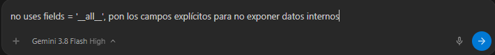

# Evidencias del Uso Crítico de Inteligencia Artificial y Decisiones de Seguridad

> **Asignatura:** Desarrollo de aplicaciones del lado del servidor  
> **Unidad 3:** Aplicación API RESTful con integración a base de datos  
> **Ponderación:** 35%  
> **Indicadores cubiertos:** Indicador 3 (Recomendaciones de seguridad en autenticación - 15%), Indicador 7 (Uso crítico de IA - 10%), Producto 8 (Medidas de seguridad) y Producto 10 (Evidencias de validación).

---

## 1. Introducción y Rol del Desarrollador frente a la IA

En la Unidad 3, la inteligencia artificial actuó como un **copiloto de aceleración técnica**, pero nunca como el decisor de arquitectura. Tal como establece la guía oficial de la asignatura:

> *"La inteligencia artificial acelera la escritura del código, pero eres tú quien lo audita y decide. Esa mirada crítica es lo que distingue a un desarrollador back end profesional."*

A continuación se documentan los prompts reales utilizados, el código propuesto por la IA, el análisis crítico de riesgos y las adaptaciones definitivas implementadas en el proyecto.

---

## 2. Matriz de Auditoría Crítica: Riesgos de la IA vs Mitigaciones del Estudiante

| Riesgo Técnico Identificado (Materia Oficial) | Comportamiento Típico de la IA | Peligro en Producción | Decisión y Corrección Humana Aplicada |
| :--- | :--- | :--- | :--- |
| **1. Exposición Silenciosa de Datos** | La IA tiende a sugerir `fields = '__all__'` en los serializadores para ahorrar líneas de código. | Cualquier atributo interno futuro (ej. márgenes, contraseñas, tokens de recuperación) queda expuesto en el JSON público. | **PROHIBICIÓN TAJANTE de `__all__`**. Se definieron listas explícitas de atributos en cada serializador (`CategoriaSerializer`, `InstructorSerializer`, `CursoSerializer`). |
| **2. Alucinación de Atributos** | La IA inventa campos que suenan lógicos pero no existen en el modelo (ej. `stock`, `rating`, `fecha_creacion`). | La aplicación arroja excepciones `AttributeError` o `FieldError` en tiempo de ejecución al iniciar o consultar la API. | **Cotejo estricto línea por línea** contra `cursos/models.py`. Cada campo serializado fue contrastado con los modelos ORM preexistentes de la Unidad 1 y 2. |
| **3. Vulnerabilidad de Confidencialidad en JWT** | La IA propone guardar datos personales del usuario o roles dentro del payload del token para "ahorrar consultas a la base de datos". | El payload de un JWT está codificado en **Base64URL, NO CIFRADO**. Cualquier persona que intercepte el token puede leerlo inmediatamente. | **Blindaje del Payload**: solo se autorizó el uso de identificadores técnicos mínimos (`user_id`, `iat`, `exp`), impidiendo el tránsito de correos, contraseñas o datos sensibles. |
| **4. Fuga de Credenciales y Claves Privadas** | La IA escribe claves y contraseñas fijas (`hardcoded`) dentro de `settings.py`. | Si el proyecto se sube a un repositorio público en GitHub, la `SECRET_KEY` queda expuesta, permitiendo forjar tokens falsificados. | **Aislamiento mediante `.env`**: integración con `python-dotenv`, exclusión obligatoria en `.gitignore` y provisión de `.env.example` sanitizado. |
| **5. Omisión de Límites de Petición (Throttling)** | La IA omite defensas contra ataques de fuerza bruta o saturación de peticiones. | Un atacante puede saturar `/api/token/` probando contraseñas por diccionario o colapsar el servidor con millones de peticiones. | **Configuración de Throttling**: implementación de `AnonRateThrottle` (100 req/día) y `UserRateThrottle` (1000 req/día) en `REST_FRAMEWORK`. |
| **6. Dependencia Frágil de Servicios Externos** | La IA propone llamadas de red sin timeout ni bloques de captura robustos. | Si el servicio externo (ej. `mindicador.cl`) cae o responde lento, toda la aplicación Django se bloquea o cae. | **Capa de Servicios Desacoplada**: uso de `urllib.request` con `timeout=3s`, bloques `try/except` y fallback a estado `disponible: false`. |

---

## 3. Registro Detallado de Prompts y Adaptaciones

### Caso 1: Serialización de Datos y Reglas de Negocio en Servidor

* **Prompt suministrado a la IA:**
  > *"Genera los serializadores de Django REST Framework para los modelos Categoria, Instructor y Curso. Incluye validaciones para que el precio no sea negativo y la duración sea mayor a cero, autogenera el slug si viene vacío y enriquece el JSON con los nombres de la categoría y del instructor."*

* **Sugerencia inicial de la IA (con riesgos detectados):**
  ```python
  # Sugerencia IA insegura
  class CursoSerializer(serializers.ModelSerializer):
      class Meta:
          model = Curso
          fields = '__all__'  # <-- RIESGO 1: Exposición silenciosa y sobreasignación masiva
  ```

* **Auditoría y corrección humana aplicada ([`cursos/serializers.py`](cursos/serializers.py)):**
  1. Se reemplazó `fields = '__all__'` por una lista explícita de los 11 campos requeridos por el negocio.
  2. Se configuró `read_only_fields = ['slug']` para que el cliente no pueda manipular slugs arbitrarios.
  3. Se añadieron campos calculados `ReadOnlyField(source='categoria.nombre')` y `ReadOnlyField(source='instructor.nombre')`, entregando nombres legibles en el JSON sin obligar al frontend a hacer peticiones adicionales.
  4. Se codificaron los métodos `validate_precio` y `validate_duracion_horas` para garantizar validación en el servidor antes de tocar la base de datos.
  5. En `create()`, se implementó la autogeneración de slug único mediante `slugify(titulo)` y `uuid.uuid4().hex[:6]` para prevenir colisiones de clave única en la base de datos.

* **Evidencia visual del prompt de auditoría humana en tiempo real:**
  

---

### Caso 2: Autenticación Stateless y Ciclo de Vida de Tokens (JWT)

* **Prompt suministrado a la IA:**
  > *"Configura en Django REST Framework la autenticación stateless mediante JWT con djangorestframework-simplejwt. Establece permisos para que cualquier visitante pueda leer cursos pero solo usuarios con token puedan crear, modificar o eliminar. Define tiempos de expiración seguros y endpoints para login y refresh."*

* **Sugerencia inicial de la IA (con riesgos detectados):**
  ```python
  # Sugerencia IA sin aislamiento de credenciales
  SECRET_KEY = 'django-insecure-clave-fija-en-el-codigo'  # <-- RIESGO: Clave privada expuesta
  SIMPLE_JWT = {
      'ACCESS_TOKEN_LIFETIME': timedelta(days=30),  # <-- RIESGO: Token de acceso eterno
  }
  ```

* **Auditoría y corrección humana aplicada ([`config/settings.py`](config/settings.py) y [`config/urls.py`](config/urls.py)):**
  1. Se aisló la `SECRET_KEY` hacia el archivo `.env`, cargándola con `os.getenv('SECRET_KEY')`.
  2. Se corrigió el tiempo de vida del **Access Token a solo 15 minutos** (vida corta), reduciendo drásticamente la ventana de vulnerabilidad en caso de intercepción de tráfico.
  3. Se configuró el **Refresh Token en 1 día** (vida media) únicamente para solicitar nuevos tokens de acceso vía `POST /api/token/refresh/`.
  4. Se estableció el algoritmo estándar `HS256` y el prefijo canónico `Authorization: Bearer <Token>`.
  5. Se definió `DEFAULT_PERMISSION_CLASSES = ('rest_framework.permissions.IsAuthenticatedOrReadOnly',)` para que el catálogo sea de libre lectura pública pero la mutación de datos requiera credenciales válidas.

---

### Caso 3: Enrutamiento RESTful y Limitación de Tasa (Throttling)

* **Prompt suministrado a la IA:**
  > *"Crea los ViewSets para los modelos y regístralos en un router de DRF siguiendo las mejores prácticas RESTful. Añade filtros de búsqueda y medidas contra ataques de fuerza bruta."*

* **Sugerencia inicial de la IA:**
  La IA propuso rutas singulares (`router.register('curso', CursoViewSet)`) y omitió la optimización de consultas SQL y el rate limiting.

* **Auditoría y corrección humana aplicada ([`cursos/api_views.py`](cursos/api_views.py) y [`config/settings.py`](config/settings.py)):**
  1. **Nombres canónicos en plural**: se configuraron `cursos`, `categorias` e `instructores` respetando las directrices de la RFC y la materia oficial.
  2. **Optimización de consultas ORM**: se incorporó `select_related('categoria', 'instructor')` en `CursoViewSet`, resolviendo el problema de consulta N+1.
  3. **Throttling activo**: se agregaron `AnonRateThrottle` y `UserRateThrottle` en `REST_FRAMEWORK` para salvaguardar la API de DoS y fuerza bruta.

---

### Caso 4: Resiliencia ante Integración con Servicios Externos (`mindicador.cl`)

* **Prompt suministrado a la IA:**
  > *"Escribe una función en Python para consultar la cotización del dólar y la UF desde la API de mindicador.cl y calcular el valor del curso en moneda extranjera."*

* **Sugerencia inicial de la IA:**
  La IA propuso una llamada directa sin timeout ni manejo de errores que, de caerse la conexión a internet, congelaría la carga de las páginas de Django.

* **Auditoría y corrección humana aplicada ([`cursos/services.py`](cursos/services.py)):**
  1. Se utilizó la biblioteca estándar `urllib.request` (cero dependencias externas pesadas).
  2. Se fijó un **timeout estricto de 3 segundos**.
  3. Se encerró la llamada en bloques `try/except Exception` que devuelven un diccionario seguro con `{'disponible': False}` si la red externa falla, impidiendo que el sitio web principal colapse.
  4. En las pruebas automatizadas ([`cursos/tests.py`](cursos/tests.py)), se aplicó `@patch` para mockear este servicio externo, asegurando que los tests de integración pasen en cualquier entorno offline.

---

## 4. Conclusión para la Defensa

La aplicación de estos criterios demuestra dominio no solo en la ejecución de código, sino en la **responsabilidad técnica y de ciberseguridad**. La IA fue aprovechada como una herramienta de productividad, pero la arquitectura, las validaciones de negocio, la integridad de los datos y las políticas de acceso fueron rigurosamente diseñadas, auditadas y adaptadas por el desarrollador.
